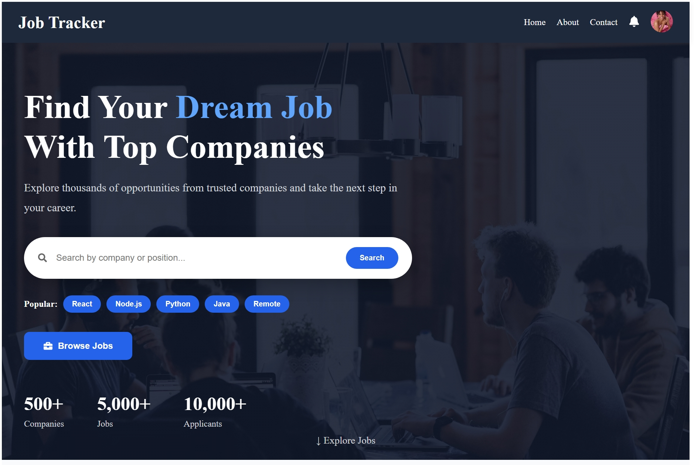
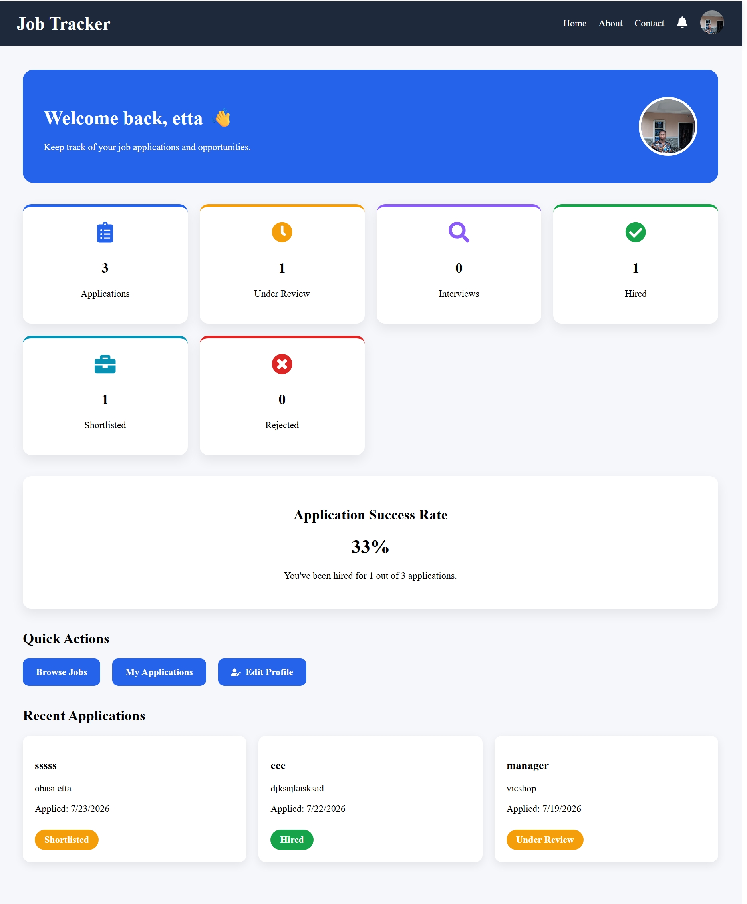
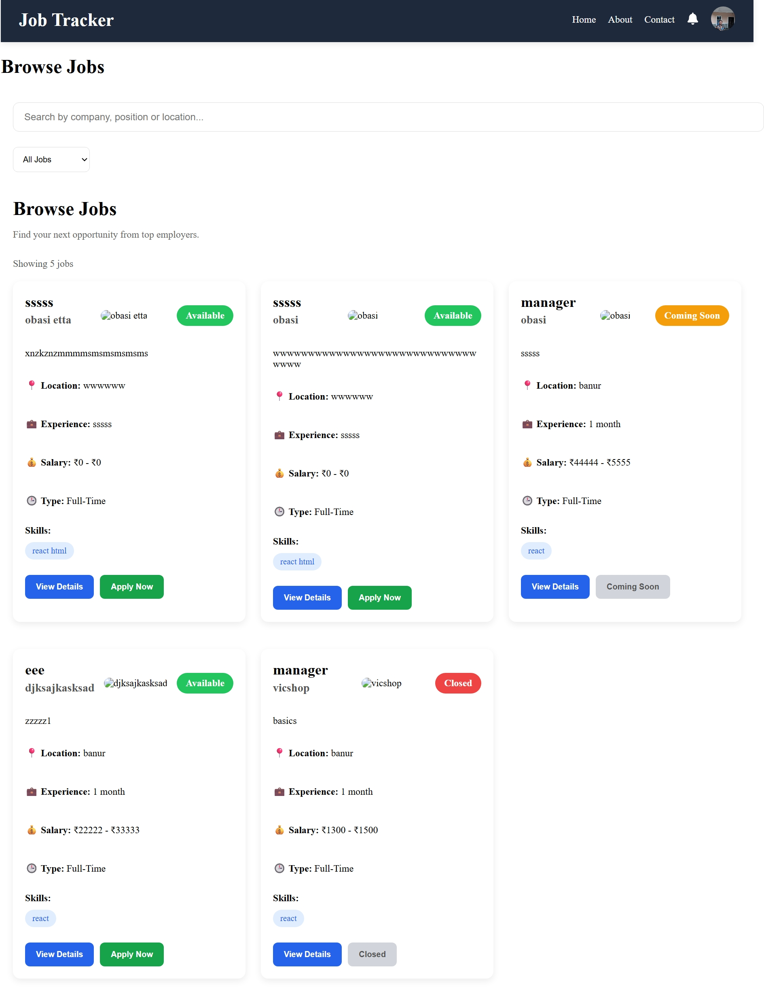
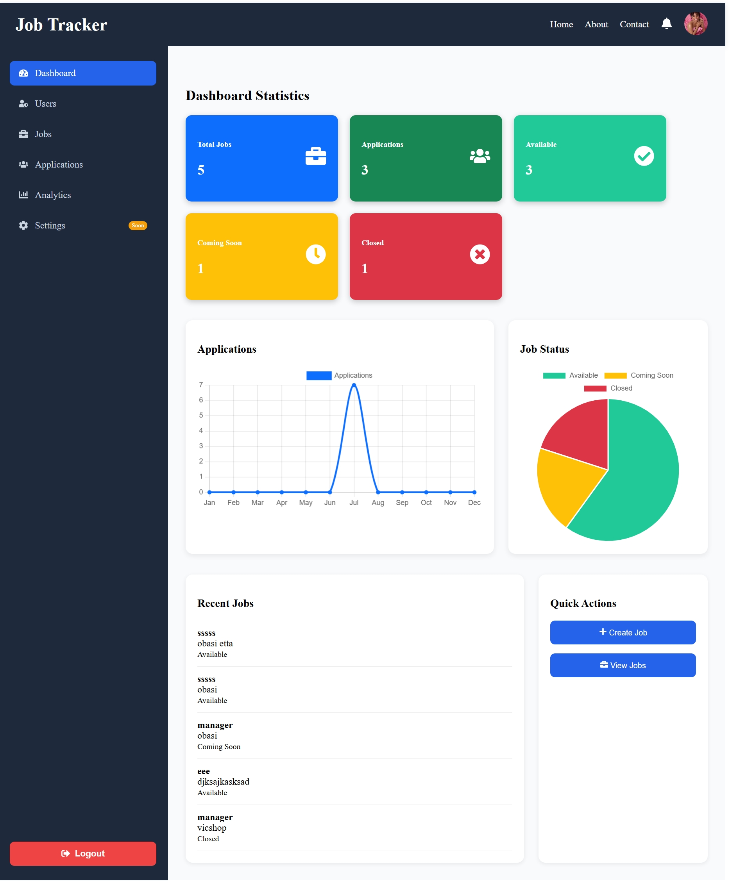
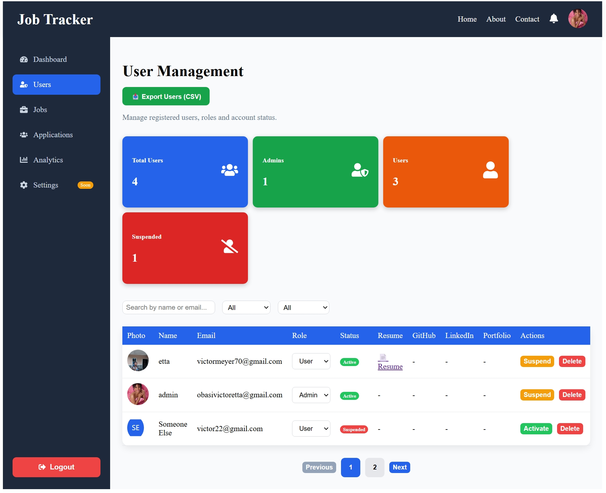
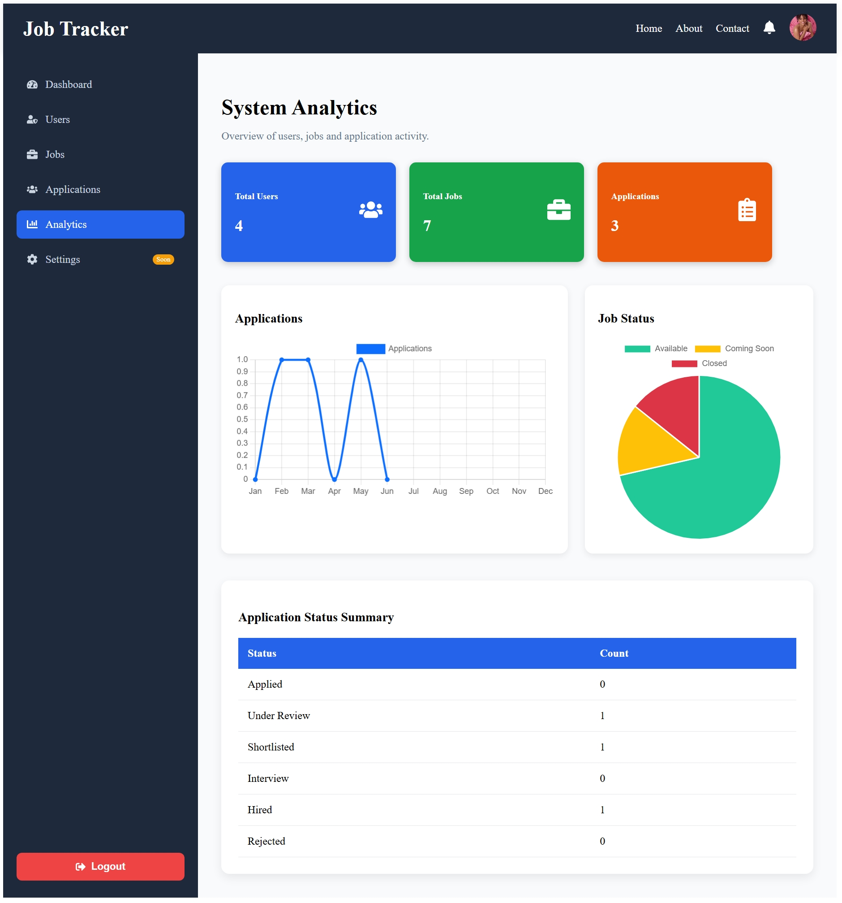

Job Application Tracker

A full-stack MERN Job Application Tracker that helps job seekers manage applications while providing administrators with a powerful dashboard to manage jobs, users, and application analytics.

Features

Applicant

- User Registration & Login
- JWT Authentication
- Forgot Password (Email Reset)
- Update Profile
- Upload Resume
- Browse Available Jobs
- View Job Details
- Apply for Jobs
- Prevent Duplicate Applications
- View My Applications
- Dashboard Statistics
- Email Notifications when application status changes

Admin

Dashboard

- Total Users
- Total Jobs
- Total Applications
- Quick Statistics

Job Management

- Create Job
- Edit Job
- Delete Job
- Activate/Deactivate Jobs
- View Applications per Job

Application Management

- View All Applications
- Search Applications
- Filter by Status
- Update Application Status
- Resume Download
- Email Notification to Applicant

User Management

- View All Users
- Search Users
- Filter by Role
- Filter by Status
- Change User Role
- Suspend / Activate User
- Delete User
- Export Users to CSV
- Pagination

Analytics

- User Statistics
- Job Statistics
- Application Statistics
- Charts
- Application Status Summary

Screenshots

Home Page

Applicant Dashboard

Browse Jobs

Admin Dashboard

User Management

Analytics

🛠 Tech Stack

Frontend

- React
- React Router
- Axios
- React Icons
- React Toastify

Backend

- Node.js
- Express.js
- MongoDB
- Mongoose
- JWT Authentication
- Multer
- Nodemailer
- bcryptjs

Project Structure

job-application-tracker/

│
├── client/
│ ├── src/
│ ├── public/
│ └── package.json
│
├── server/
│ ├── controllers/
│ ├── middleware/
│ ├── models/
│ ├── routes/
│ ├── utils/
│ ├── uploads/
│ └── package.json
│
└── README.md

Installation

Clone Repository

bash
git clone https://github.com/Victoretta/job-application-tracker.git

Move into the project folder:

bash
cd job-application-tracker

Backend

bash
cd server
npm install
npm run dev

Frontend

bash
cd client
npm install
npm run dev

Environment Variables

Create a `.env` file inside the `server` folder.

.env
PORT=5000

MONGO_URI=your_mongodb_connection

JWT_SECRET=your_secret_key

EMAIL_USER=your_email@gmail.com

EMAIL_PASS=your_email_password

CLIENT_URL=http://localhost:5173

API Overview
Authentication

POST /api/users/register

POST /api/users/login

POST /api/users/forgot-password

POST /api/users/reset-password/:token

Jobs

GET /api/jobs

GET /api/jobs/:id

POST /api/jobs

PUT /api/jobs/:id

DELETE /api/jobs/:id

Applications

POST /api/applications/:jobId

GET /api/applications/my

GET /api/applications

PUT /api/applications/:id/status

Admin

GET /api/admin/analytics

GET /api/admin/users

GET /api/admin/users/:id

PUT /api/admin/users/:id/role

PUT /api/admin/users/:id/status

DELETE /api/admin/users/:id

Current Features

- Authentication
- Authorization
- Resume Upload
- Forgot Password
- Email Notifications
- Applicant Dashboard
- Admin Dashboard
- User Management
- Job Management
- Analytics
- Charts
- CSV Export
- Pagination

Future Improvements

- Excel (.xlsx) Export
- PDF Resume Preview
- Dark Mode
- Advanced Analytics
- Email Templates
- Real-Time Notifications
- Saved Jobs
- Company Profiles
- Interview Scheduling
- Admin Activity Logs
- Two-Factor Authentication (2FA)
- Docker Support
- Deployment (Render + Vercel)

Author

Obasi Victor Etta

GitHub:
https://github.com/Victoretta

Email:
obasivictoretta@gmail.com

License

This project is licensed under the MIT License.

If you found this project useful, consider giving it a star on GitHub!
